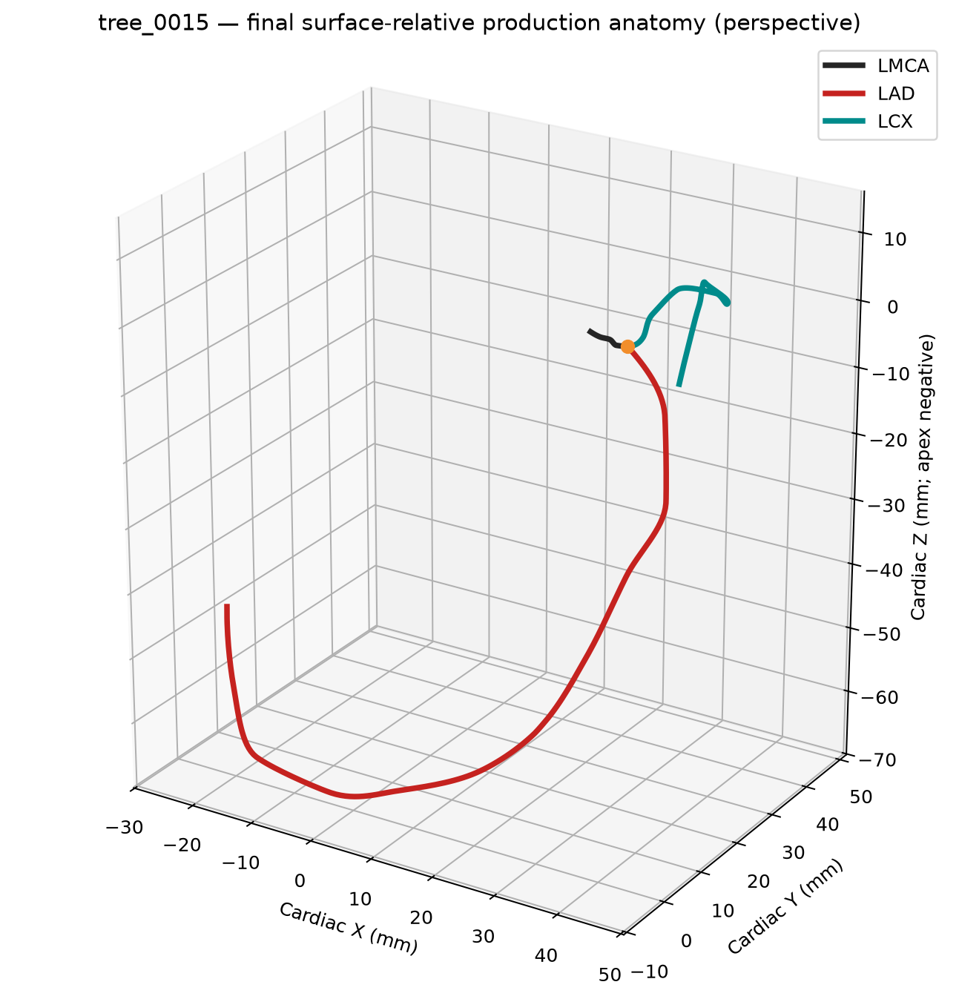
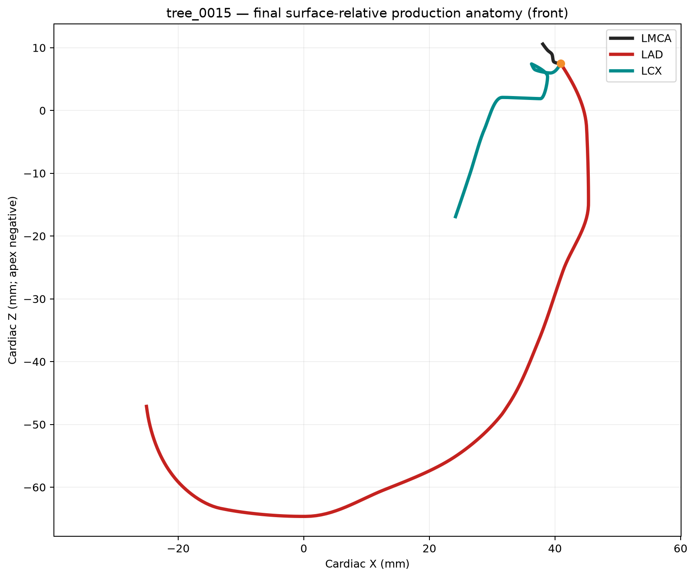
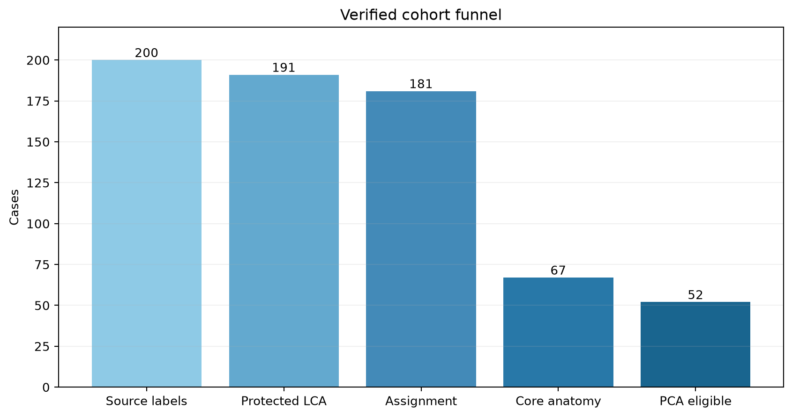
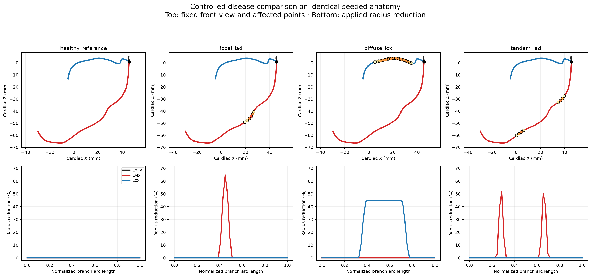
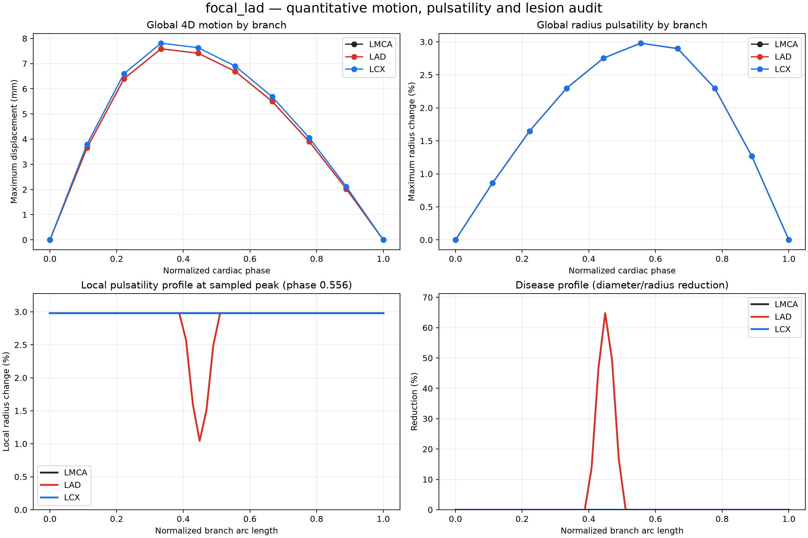
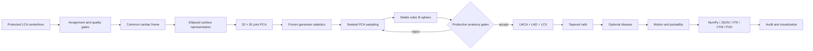
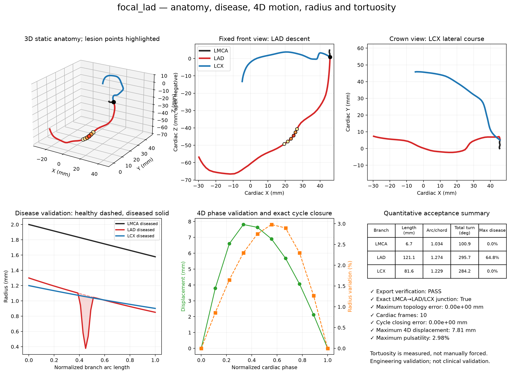

# Coronary4D — Disease-Aware 4D LCA Tree Generator

<div align="center">

**A reproducible research and engineering pipeline for generating, modifying, validating, and visualizing 3D/4D left-coronary artery trees.**

[](https://github.com/AnjanThakur/vessel_tree_generator/actions/workflows/ci.yml)




*Validated representative LCA tree: LMCA bifurcating into LAD and LCX around the cardiac scaffold.*

[Quick start](#quick-start) · [How it works](#how-it-works) · [Visual results](#visual-results) · [Validation](#validation) · [ParaView](#paraview-presentation) · [Documentation](#documentation)

</div>

> [!IMPORTANT]
> Coronary4D is an **LCA-only research/engineering prototype**, not a clinically validated device. It generates LMCA, LAD, and LCX; RCA is intentionally excluded because resolved RCA ground truth was unavailable. Disease, radius, motion, pulsatility, and compliance are explicit parametric models—not patient-learned clinical predictors.

## Overview

Coronary4D converts a frozen, population-derived statistical anatomy model into complete vessel-tree cases with:

- labeled `LMCA + LAD + LCX` centerlines and exact shared bifurcations;
- stable cubic B-spline geometry with anatomical production gates;
- tapered radii and optional focal, diffuse, or tandem stenosis;
- ten-frame cardiac motion with local lesion compliance reduction;
- centerline and surface-mesh exports for ParaView;
- numerical validation, visual dashboards, animated GIFs, and interactive HTML;
- deterministic seeds, file manifests, hashes, and independent VTK readback.

The compact frozen generator statistics are versioned with the repository, so normal generation and verification do **not** require the protected source NIfTI volumes.

## Visual results

<table>
  <tr>
    <td align="center" width="50%">
      <br>
      <b>Representative anatomy — front view</b>
    </td>
    <td align="center" width="50%">
      <br>
      <b>Audited source-to-model cohort</b>
    </td>
  </tr>
  <tr>
    <td align="center" width="50%">
      <br>
      <b>Controlled disease configurations</b>
    </td>
    <td align="center" width="50%">
      <br>
      <b>4D motion quality control</b>
    </td>
  </tr>
</table>

Additional verified figures—including PCA variance, real-versus-generated measurements, novelty, holdout results, tortuosity, pulsatility, and VTK export checks—are in [`submission_release/final_validation/`](submission_release/final_validation/).

## Verified system at a glance

| Item | Verified result |
|---|---:|
| Source label volumes available locally | 200 |
| Protected raw LCA centerline records | 191 |
| Confident multi-signal daughter assignments | 181 |
| Source/scaffold core-gate cases | 65 |
| Independent PCA-eligible anatomies | 52 |
| PCA representation | 52 × 81 |
| Retained PCA modes | 13 |
| Cumulative variance retained | 95.55% |
| Accepted generated production trees | 52 / 52 in 64 attempts |
| Real-versus-generated comparisons | 50 / 50 pass |
| Production topology/anatomy gate | 52 / 52 pass |
| Stricter descriptive anatomy rules | 35 / 52 pass |
| Stored cardiac frames per case | 10 (9 independent + closure) |
| Automated regression tests | 102 passing, 0 failing |

The 52 training anatomies are independent eligible cases. Synthetic derivatives and cardiac phases are **not** counted as new patients. The 35/52 value is a stricter descriptive result; it does not replace the 52/52 production coordinate/topology result.

## How it works



The production representation uses fixed branch samples in a common LMCA-based cardiac frame. Surface-relative tangent-`u`, tangent-`v`, and normal deviations form one joint 81-dimensional vector, preserving cross-branch covariance. Generated controls are reconstructed as smooth B-splines and accepted only when topology, continuity, LAD/LCX anatomical behavior, and clearance checks pass.

## Technologies

| Area | Technology | Role |
|---|---|---|
| Language and packaging | Python 3.10+, setuptools | Runtime, CLI, installable API |
| Numerical computing | NumPy, SciPy | PCA reconstruction, geometry, interpolation, metrics |
| 3D and mesh processing | PyVista, VTK | Centerlines, tapered surfaces, VTP/VTM/PVD export and readback |
| Scientific plotting | Matplotlib | Static QC, anatomy, motion, and population figures |
| Interactive visualization | Plotly | Rotatable browser-based 3D review |
| Media and reporting | Pillow, python-docx | GIF/image processing and per-tree reports |
| Verification | pytest, `compileall`, `pip check` | Deterministic regression and environment checks |
| Automation | GitHub Actions | Clean-environment CI on pushes and pull requests |
| Data contracts | NumPy, JSON, VTK XML | Portable geometry, metadata, manifests, and presentation files |

## Quick start

### Windows PowerShell

```powershell
git clone https://github.com/AnjanThakur/vessel_tree_generator.git
cd vessel_tree_generator
py -3.11 -m venv .venv
.\.venv\Scripts\python.exe -m pip install --upgrade pip
.\.venv\Scripts\python.exe -m pip install -e ".[dev]"
.\.venv\Scripts\python.exe tools\verify_final_deliverable.py
```

### Linux or macOS

```bash
git clone https://github.com/AnjanThakur/vessel_tree_generator.git
cd vessel_tree_generator
python3 -m venv .venv
.venv/bin/python -m pip install --upgrade pip
.venv/bin/python -m pip install -e ".[dev]"
.venv/bin/python tools/verify_final_deliverable.py
```

## Generate a case

Create a reproducible focal LAD stenosis case:

```powershell
.\.venv\Scripts\python.exe -m vessel_tree_generator generate `
  --output-dir my_case --preset focal --branch LAD `
  --position 0.45 --length 0.12 --severity 0.65 --clean
```

Generate healthy, focal, diffuse, and tandem cases on the **same seeded anatomy**:

```powershell
.\.venv\Scripts\python.exe -m vessel_tree_generator demo `
  --output-dir submission_release\demo_cases --clean
```

Inspect every command and option:

```powershell
.\.venv\Scripts\python.exe -m vessel_tree_generator --help
.\.venv\Scripts\python.exe -m vessel_tree_generator generate --help
```

The installed console command `coronary4d` is equivalent to `python -m vessel_tree_generator`.

## Python API

```python
from vessel_tree_generator import CoronaryTreeGenerator, GenerationConfig, stenosis_config
from vessel_tree_generator.export import export_case

generator = CoronaryTreeGenerator()
disease = stenosis_config(
    branch_id="LAD",
    position=0.45,
    length=0.12,
    severity=0.65,
    lesion_type="focal",
)

case = generator.generate_case(
    disease_config=disease,
    generation=GenerationConfig(seed=42),
)
export_case(case, "my_case", clean=True)
```

See [`examples/`](examples/) for complete disease configurations and [`SUBMISSION_GUIDE.md`](SUBMISSION_GUIDE.md) for the supported API and schema.

## Disease and 4D controls

| Control | Meaning |
|---|---|
| `branch` | Target `LAD` or `LCX` |
| `position` | Lesion center in normalized branch arc length |
| `length` | Affected normalized branch extent |
| `severity` | Fractional radius reduction at maximum stenosis |
| `kind` | `healthy`, `focal`, `diffuse`, or `tandem` |
| `seed` | Reproducible anatomy and stochastic choices |

Disease changes vessel radius, not centerline anatomy. Pulsatility is applied globally with reduced local compliance at lesions. Cardiac motion preserves exact LMCA-to-daughter junctions and closes exactly at the repeated final phase.

## Output contract

A generated case contains the same labeled topology in static and cine forms:

```text
my_case/
├── geometry_static.npy       # (3, P, 4): branch, point, x/y/z/radius
├── geometry_cine.npy         # (T, 3, P, 4): phase, branch, point, values
├── graph.json                # branch connectivity and point ranges
├── metadata.json             # parameters, measurements, provenance
├── manifest.json             # file inventory and SHA-256 hashes
├── preview.png               # fast visual check
└── vtk/
    ├── cine.pvd              # ParaView time-series entry point
    ├── phase_000/ ...        # branch VTP and tree VTM files
    └── phase_009/
```

The statistical representation contains 27 controls: LMCA 5, LAD 12, and LCX 10. Portable exports resample each branch to 50 points by default. Coordinates and radii are in millimetres. Metadata records whether a quantity is population-derived or parametric.

## ParaView presentation

The repository includes ready-to-open centerline, mesh, scaffold, and 4D files.

| Goal | Open this file |
|---|---|
| Representative static anatomy | [`submission_release/final_presentation/final_static_tree.vtm`](submission_release/final_presentation/final_static_tree.vtm) |
| Anatomy with cardiac scaffold | [`submission_release/final_presentation/final_tree_with_scaffold.vtm`](submission_release/final_presentation/final_tree_with_scaffold.vtm) |
| Representative 4D playback | [`submission_release/final_presentation/cine.pvd`](submission_release/final_presentation/cine.pvd) |
| Tapered diseased mesh | [`submission_release/final_presentation_52/tree_0015/diseased_tapered_mesh.vtm`](submission_release/final_presentation_52/tree_0015/diseased_tapered_mesh.vtm) |
| Diseased mesh plus centerlines | [`submission_release/final_presentation_52/tree_0015/diseased_mesh_with_centerlines.vtm`](submission_release/final_presentation_52/tree_0015/diseased_mesh_with_centerlines.vtm) |

In ParaView:

1. Open a `.vtm` for static/mesh inspection or `cine.pvd` for animation.
2. Click **Apply** in the Properties panel.
3. Use **Surface** for mesh files and **Render Lines As Tubes** for centerlines.
4. Color by `radius_mm`, `diameter_mm`, or `disease_reduction_fraction` where available.
5. For `cine.pvd`, press **Play** and enable **Loop**.

The complete verified 52-tree presentation cohort is under [`submission_release/final_presentation_52/`](submission_release/final_presentation_52/). Meshes are intentionally separate from centerline overlays so tapering and disease can be presented without visual ambiguity.

## Visualization and reports

Create a validation dashboard, tortuosity/curvature plot, looping 4D GIF, quantitative JSON, and interactive 3D HTML:

```powershell
.\.venv\Scripts\python.exe -m vessel_tree_generator visualize `
  --input-dir my_case --clean --standalone-html
```

Run the anatomy, disease, motion, and local/global pulsatility audit:

```powershell
.\.venv\Scripts\python.exe -m vessel_tree_generator audit `
  --input-dir submission_release\demo_cases --release
```

<p align="center">
  <br>
  <i>Quantitative local/global pulsatility and compliance validation.</i>
</p>

## Validation

Run the final deliverable verifier:

```powershell
.\.venv\Scripts\python.exe tools\verify_final_deliverable.py
```

Run the regression suite and environment checks:

```powershell
.\.venv\Scripts\python.exe -m pytest -q
.\.venv\Scripts\python.exe -m compileall -q vessel_tree_generator pca_ssm_vessel_tree_generator tests tools
.\.venv\Scripts\python.exe -m pip check
git diff --check
```

The final verifier checks frozen-statistics hashes, 52 presentation packages, 520 cine frames, demo exports, release hashes, VTK readability, finite arrays, topology, and artifact integrity. Generation gates require:

- exact `LMCA → LAD + LCX` topology and zero bifurcation gap;
- LMCA shorter than both daughters;
- LAD-dominant inferior/apical course;
- LCX lateral/crown-like course rather than apex-descending behavior;
- 3D tangent continuity and nonlocal/inter-branch clearance;
- finite radii, legal disease bounds, cardiac closure, and VTK round-trip integrity.

Population intervals are descriptive warnings. Core topology and anatomical contradictions reject a generated candidate. Full-centerline fit error remains descriptive because the output is a smooth anatomical scaffold, not a point-for-point reconstruction of segmentation noise.

## Statistical-model maintenance

Normal users do not need to rebuild the model. For audited maintenance workflows:

```powershell
.\.venv\Scripts\python.exe pipeline.py compute-stats --clean
.\.venv\Scripts\python.exe pipeline.py generate --clean
.\.venv\Scripts\python.exe pipeline.py validate --clean
.\.venv\Scripts\python.exe pipeline.py motion
.\.venv\Scripts\python.exe pipeline.py export
.\.venv\Scripts\python.exe pipeline.py novelty-validate
.\.venv\Scripts\python.exe pipeline.py holdout-validate
.\.venv\Scripts\python.exe pipeline.py audit-final
```

Or run the complete sequence:

```powershell
.\.venv\Scripts\python.exe pipeline.py run-all --clean
```

## Project structure

```text
vessel_tree_generator/
├── vessel_tree_generator/              # Supported API, CLI, disease, mesh, audit, export
├── pca_ssm_vessel_tree_generator/      # Alignment, PCA, generation, motion, validation
├── outputs/lca_ssm/                    # Canonical model/cohort/motion/export outputs
├── submission_release/                 # Curated reports, evidence, visuals, 52-tree package
├── examples/                           # Reusable generation configurations
├── tests/                              # Deterministic integration/regression tests
├── tools/                              # Release verification and presentation builders
├── docs/                               # Architecture and archive documentation
├── pipeline.py                         # Statistical workflow orchestrator
└── pyproject.toml                      # Package metadata and dependencies
```

Historical trials and excluded RCA utilities are preserved on `latestt_branchh` at commit `7b21ce4`; they are not required for the final LCA runtime. Local protected data and archived experiments are intentionally excluded from the deliverable.

## Reproducibility and provenance

- The runtime loads hash-locked statistics from [`outputs/lca_ssm/lca_population_model/generator_statistics/`](outputs/lca_ssm/lca_population_model/generator_statistics/).
- A seed reproduces generation choices and is stored with output metadata.
- Every exported case has a manifest and SHA-256 inventory.
- Validation reopens written NumPy and VTK artifacts instead of trusting in-memory objects.
- Protected source centerlines and frozen statistical packages are not modified during case generation.
- Motion amplitude, proximal diameters, taper, disease, pulsatility, and compliance remain explicitly parametric.

## Scope and limitations

- **Research prototype:** not clinically validated and not intended for diagnosis, treatment planning, or patient-specific prediction.
- **LCA only:** LMCA, LAD, and LCX are supported; RCA and smaller side branches are outside the current model.
- **Cohort size:** PCA uses 52 independent eligible anatomies, limiting coverage of rare anatomical variants.
- **Simplified physiology:** motion and wall/radius behavior are kinematic parametric approximations, not CFD, FSI, haemodynamic simulation, or learned biomechanics.
- **Centerline model:** generated surfaces are visualization meshes derived from radius-bearing centerlines, not segmented vessel-wall reconstructions.
- **Validation meaning:** production gates establish internal anatomical/topological consistency; they do not establish clinical normality.

## Documentation

| Document | Purpose |
|---|---|
| [`SUBMISSION_GUIDE.md`](SUBMISSION_GUIDE.md) | Setup, API, disease convention, schema, and user workflow |
| [`docs/ARCHITECTURE.md`](docs/ARCHITECTURE.md) | Production data flow and integrity boundaries |
| [`pca_ssm_vessel_tree_generator/generation/README.md`](pca_ssm_vessel_tree_generator/generation/README.md) | Statistical generation contract |
| [`submission_release/final_presentation/README.md`](submission_release/final_presentation/README.md) | Canonical ParaView walkthrough |
| [`submission_release/FINAL_CODEBASE_CLEANUP_AUDIT.md`](submission_release/FINAL_CODEBASE_CLEANUP_AUDIT.md) | Final repository cleanup and verification evidence |
| [`submission_release/RELEASE_MANIFEST.json`](submission_release/RELEASE_MANIFEST.json) | Machine-readable release inventory and hashes |
| [`docs/ARCHIVE.md`](docs/ARCHIVE.md) | Historical content retained outside the final runtime |

## Responsible use

Use generated trees for research, software testing, visualization, education, and method development. Report model provenance, seed, disease parameters, and the limitations above whenever outputs are shared.

---

<div align="center">
  <b>Coronary4D</b><br>
  Population-derived anatomy · Controlled disease · Parametric 4D motion · Reproducible validation
</div>
